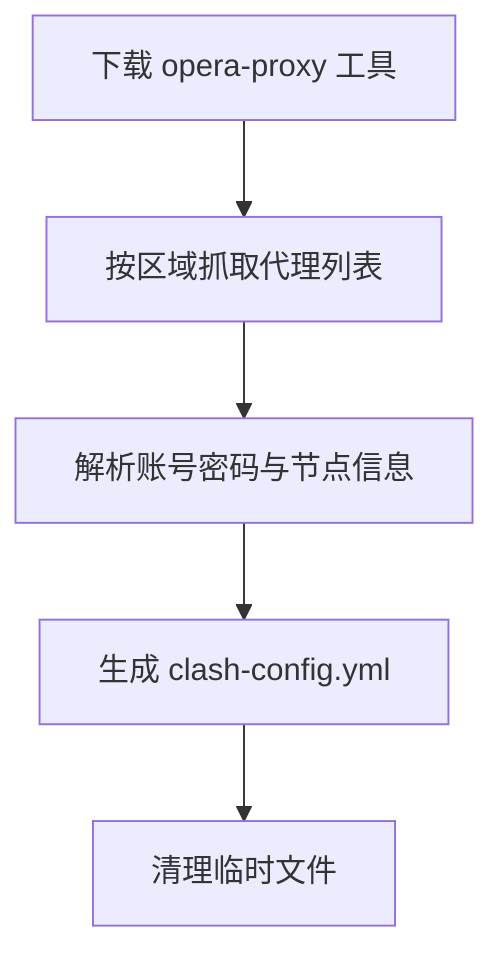

# Proxy Config Generator

自动抓取 Opera Proxy 节点并生成 [Clash](https://github.com/Dreamacro/clash) 格式代理配置的工具。

## 功能特性

- 🔄 自动从 GitHub Releases 下载 `opera-proxy` 工具（linux-amd64）
- 🌍 支持三大区域代理节点抓取：
  - **AM** — Americas（美洲）
  - **AS** — Asia（亚洲，节点命名为 `Singapore`）
  - **EU** — Europe（欧洲，节点命名为 `Finland`）
- 📝 自动解析代理账号密码（Proxy login / Proxy password）
- ⚙️ 生成 Clash 兼容的 `clash-config.yml`，节点使用 TLS + SNI 加密传输
- 🧹 抓取完成后自动清理临时文件

## 环境要求

- Python 3.6+
- [PyYAML](https://pyyaml.org/)（`pip install pyyaml`）

## 使用方法

### 1. 安装依赖

```bash
pip install pyyaml
```

### 2. 运行脚本

```bash
python3 generate_proxy_config.py
```

脚本执行流程：



### 3. 使用生成的配置

将生成的 `clash-config.yml` 导入 Clash 客户端（如 Clash Verge、ClashX、Clash for Windows 等），或作为订阅链接配置使用。

## 输出说明

生成的 `clash-config.yml` 结构示例：

```yaml
proxies:
- name: Americas-01        # 节点名称：区域-序号
  type: http               # 代理协议
  server: 77.111.246.19    # 服务器 IP
  port: 443                # 端口
  username: <login>        # 代理账号
  password: <token>        # 代理密码（JWT Token）
  tls: true                # 启用 TLS 加密
  skip-cert-verify: true   # 跳过证书校验
  sni: am0.sec-tunnel.com  # SNI 域名
```

节点命名规则：`{区域显示名}-{两位序号}`，例如 `Americas-01`、`Singapore-01`、`Finland-04`。

## 项目结构

```
proxy-1/
├── generate_proxy_config.py   # 主脚本
├── clash-config.yml           # 生成的 Clash 配置（输出）
└── README.md                  # 项目说明
```

## 脚本详解

| 方法 | 说明 |
| --- | --- |
| `download_tool()` | 下载 opera-proxy 二进制并赋予可执行权限 |
| `fetch_proxies()` | 遍历 AM / AS / EU 区域，调用工具抓取代理列表 |
| `parse_data()` | 正则解析代理账号密码及 `host,ip,port` 格式的节点数据 |
| `generate_yaml()` | 生成 Clash 格式的 YAML 配置并写入 `clash-config.yml` |
| `run()` | 主流程入口 |

## 注意事项

- ⚠️ 生成的 `clash-config.yml` 包含代理账号凭证，请勿提交到公共仓库
- 脚本输出兼容 GitHub Actions 的 group / warning / error 日志格式，可直接用于 CI
- 仅支持 linux-amd64 平台的 opera-proxy 工具（下载地址可在脚本中修改）
- `skip-cert-verify: true` 表示跳过证书校验，如遇安全要求可手动调整

## License

MIT
